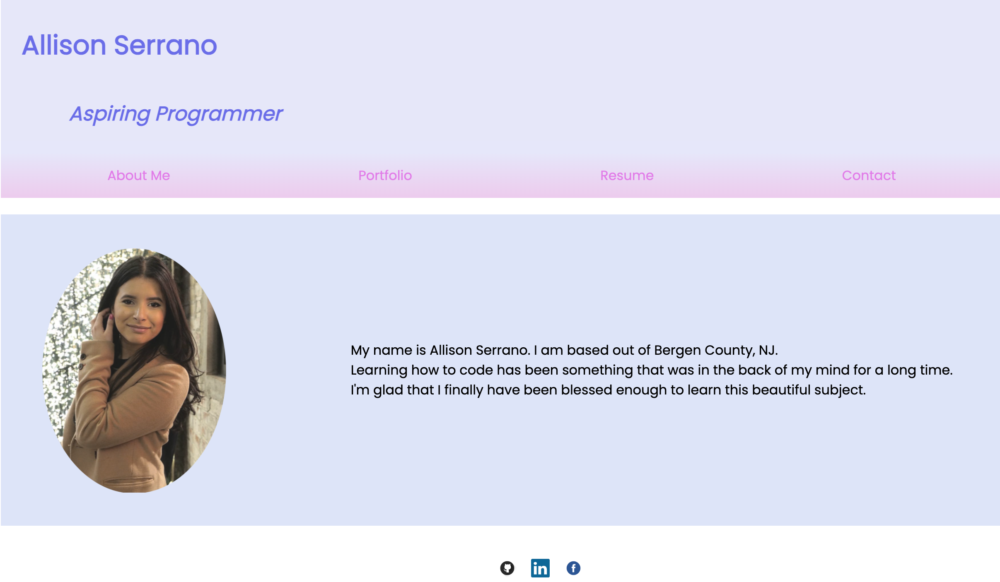
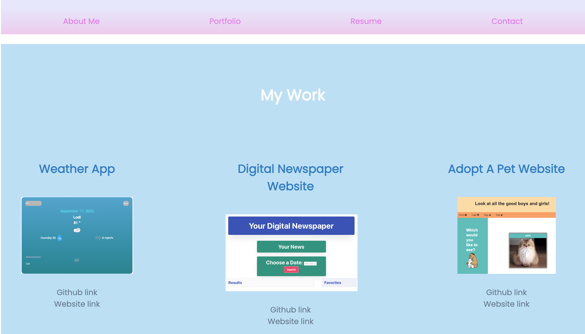
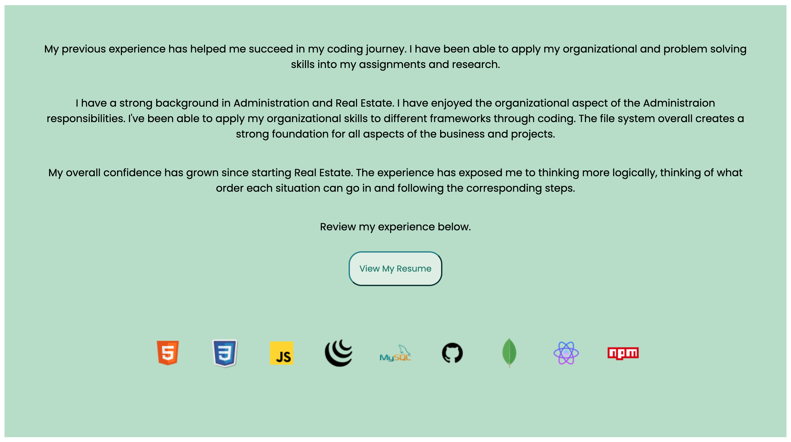
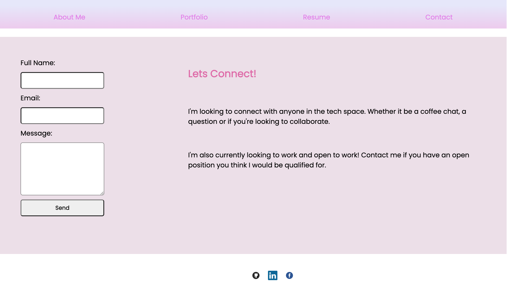

# Allison's Portfolio

## Description
This website is for the purpose of show casing my work to potential employers and anyone in the tech community who is looking for someone to connect with.

## Table of Contents
-[User Story](#User-Story)

-[Acceptance Criteria](#Acceptance-Criteria)

-[My Successes and Challenges](#My-Successes-and-Challenges)

-[User Interface](#User-Interface)

-[Links](#Links)

-[Future Development](#Future-Development)

-[Technologies Used](#Technologies-Used)

-[Author](#Author)

## User Story
```md
AS AN employer looking for candidates with experience building single-page applications
I WANT to view a potential employee's deployed React portfolio of work samples
SO THAT I can assess whether they're a good candidate for an open position
````

## Acceptance Criteria
```md
GIVEN a single-page application portfolio for a web developer
WHEN I load the portfolio
THEN I am presented with a page containing a header, a section for content, and a footer
WHEN I view the header
THEN I am presented with the developer's name and navigation with titles corresponding to different sections of the portfolio
WHEN I view the navigation titles
THEN I am presented with the titles About Me, Portfolio, Contact, and Resume, and the title corresponding to the current section is highlighted
WHEN I click on a navigation title
THEN I am presented with the corresponding section below the navigation without the page reloading and that title is highlighted
WHEN I load the portfolio the first time
THEN the About Me title and section are selected by default
WHEN I am presented with the About Me section
THEN I see a recent photo or avatar of the developer and a short bio about them
WHEN I am presented with the Portfolio section
THEN I see titled images of six of the developer’s applications with links to both the deployed applications and the corresponding GitHub repository
WHEN I am presented with the Contact section
THEN I see a contact form with fields for a name, an email address, and a message
WHEN I move my cursor out of one of the form fields without entering text
THEN I receive a notification that this field is required
WHEN I enter text into the email address field
THEN I receive a notification if I have entered an invalid email address
WHEN I am presented with the Resume section
THEN I see a link to a downloadable resume and a list of the developer’s proficiencies
WHEN I view the footer
THEN I am presented with text or icon links to the developer’s GitHub and LinkedIn profiles, and their profile on a third platform (Stack Overflow, Twitter)
````

## Successes and Challanges
One of my success was finding out about EmailJS and then implementing it in my contact form. I was going to do one manually but then thought "how is this going to get in my inbox?". I started researching for tools and found EmailJS. All I had to do was create an account. One of my challenges was trying to use media queries for my footer. When I shrink the page the icons move to the left instead of staying in the center. I was not able to fix this but I will continue to work on it. 

## User Interface
### Home Page

### My Work

### Resume

### Contact Me


## Links
Github repository: https://github.com/Allicris/allison-cristine
Deployed Link: https://allisoncristine.netlify.app/

## Future Deployment
I would like to use media queries for this website. I was having a hard time trying to implement that for my footer icons. 

## Technologies Used
- React
- React Dom
- React Router Dom
- EmailJS
- Netlify

## Author
Allison C. Serrano
